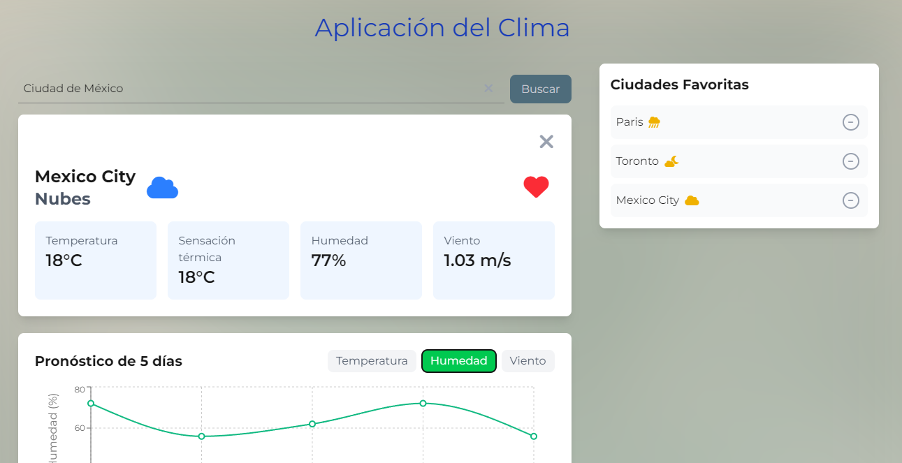

# Aplicación del Clima



Una aplicación web moderna para consultar el clima en tiempo real de cualquier ciudad del mundo, con funcionalidades como ciudades favoritas, pronóstico extendido y visualización de datos meteorológicos.

##  Tecnologías Utilizadas

- **Next.js 14** - Framework de React para desarrollo web
- **TypeScript** - Superset tipado de JavaScript
- **Tailwind CSS** - Framework de utilidades CSS
- **Axios** - Cliente HTTP para peticiones API
- **Recharts** - Biblioteca de gráficos para React
- **Font Awesome** - Iconos vectoriales
- **OpenWeatherMap API** - API de datos meteorológicos

##  Prerrequisitos

- Node.js 18.0.0 o superior
- npm o yarn
- Cuenta en OpenWeatherMap (para obtener API key)
- Cuenta en GitHub

##  Instalación

1. Clona el repositorio:
```bash
git clone https://github.com/tu-usuario/app-clima.git
cd app-clima
```

2. Instala las dependencias:
```bash
npm install
# o
yarn install
```

##  Ejecución

Para ejecutar el proyecto en modo desarrollo:

```bash
npm run dev
# o
yarn dev
```

La aplicación estará disponible en `http://localhost:3000`

Para construir la versión de producción:

```bash
npm run build
npm start
# o
yarn build
yarn start
```


Disponible en: 
`https://tu-usuario.github.io/app-clima`
`https://buscador-de-imagenes-react.vercel.app/`

⚠️ **Nota sobre el despliegue:**  
> Actualmente, el despliegue en producción no es completamente funcional debido a configuraciones adicionales requeridas.
  
> Por esta razón, se recomienda clonar el repositorio y ejecutar el proyecto de forma local para asegurar el correcto funcionamiento y poder realizar pruebas sin inconvenientes.

##  API Key de Prueba

Para desarrollo y pruebas, puedes usar la siguiente API key:
```
729d536913428102ed055faf12ed693b
```

**Nota**: Esta es una API key de prueba con límites de uso. Para un entorno de producción, se recomienda obtener tu propia API key en [OpenWeatherMap](https://openweathermap.org/api).

##  Características

- Búsqueda de ciudades con autocompletado
- Visualización del clima actual
- Pronóstico extendido de 5 días
- Gráficos interactivos de temperatura
- Ciudades favoritas con almacenamiento local
- Diseño responsive
- Tema claro/oscuro
- Animaciones y transiciones suaves

##  Uso

1. Ingresa el nombre de una ciudad en el buscador
2. Selecciona la ciudad de las sugerencias
3. Visualiza el clima actual y el pronóstico
4. Agrega ciudades a favoritos usando el botón de corazón
5. Accede a tus ciudades favoritas desde el panel lateral

##  Contribuir

Las contribuciones son bienvenidas. Para contribuir:

1. Haz fork del proyecto
2. Crea una rama para tu feature (`git checkout -b feature/AmazingFeature`)
3. Commit tus cambios (`git commit -m 'Add some AmazingFeature'`)
4. Push a la rama (`git push origin feature/AmazingFeature`)
5. Abre un Pull Request

## Soporte

Si encuentras algún problema o tienes alguna sugerencia, por favor abre un issue en el repositorio.
